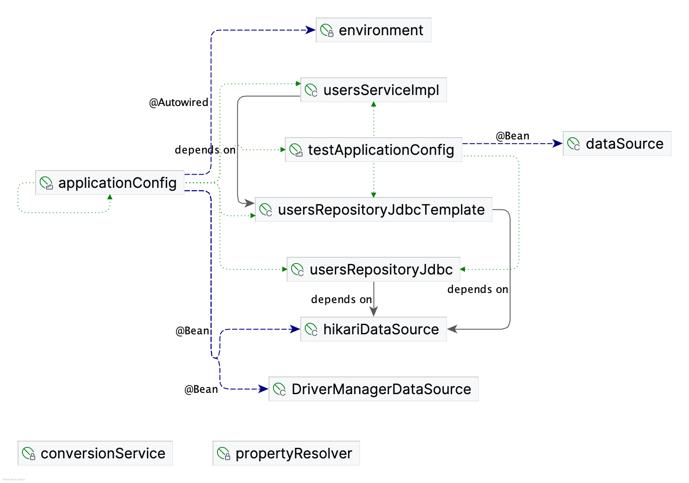

# Java Bootcamp: Spring

## Overview
Introduce the Spring Framework, a popular choice for enterprise-level Java development due to its robustness and ease of use.

## Tasks

### Exercise 00: Spring Context
- **Objective**: Implement a Spring context for a loosely-coupled system.
- **Directory**: `ex00`
- **Files**: `Spring-folder`
- **Key Concepts**: Spring Context, Dependency Injection, Inversion of Control

### Exercise 01: JdbcTemplate
- **Objective**: Implement a JdbcTemplate and NamedParameterJdbcTemplate for database operations.
- **Directory**: `ex01`
- **Files**: `Service-folder`
- **Key Concepts**: JdbcTemplate, NamedParameterJdbcTemplate, RowMapper, DataSource

### Exercise 02: AnnotationConfig
- **Objective**: Configure Spring application using annotations.
- **Directory**: `ex02`
- **Files**: `Service-folder`
- **Key Concepts**: @Configuration, @Bean, @Autowired, @Qualifier

**Project structure**:
- Service
    - src
        - main
            - java
                - school21.spring.service
                    - config
                        - ApplicationConfig
                    - models
                        - User
                    - repositories
                        - CrudRepository
                        - UsersRepository
                        - UsersRepositoryJdbcImpl
                        - UsersRepositoryJdbcTemplateImpl
                    - services
                        - UsersService
                        - UsersServiceImpl
                    - application
                        - Main
            - resources
                -   db.properties
        - test
            - java
                - school21.spring.service
                    - config
                        - TestApplicationConfig
                    - services
                        - UsersServiceImplTest
    -   pom.xml

**Beance dependencies diagram**:

